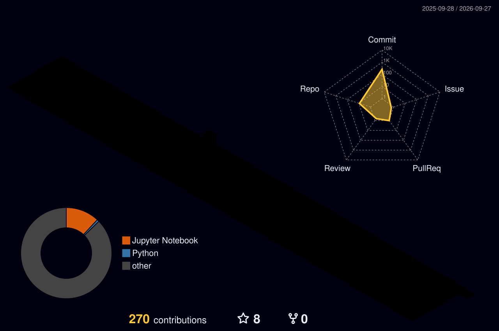

<!-- ════════════════════════════════════════════════════════════ -->
<!--  ATUL KUMAR CHOUDHARY · Full Stack AI Engineer              -->
<!-- ════════════════════════════════════════════════════════════ -->

<div align="center">


<br><br>

# &nbsp; Atul Kumar Choudhary &nbsp;

<samp>Full Stack AI Engineer · Building intelligent systems that scale</samp>

<br><br>

[](mailto:dev@atulchoudhary.com)
&nbsp;&nbsp;
[](https://linkedin.com/in/atulkumarchoudhary)
&nbsp;&nbsp;
[](https://github.com/atul-kumar-choudhary)

<br>


&nbsp;
[](https://github.com/atul-kumar-choudhary?tab=followers)
&nbsp;


</div>

<br>

<!-- ─────────────────────── ABOUT ─────────────────────── -->

<table>
<tr>
<td valign="top" width="50%">

### &nbsp;`About`

I design and ship production-grade AI systems — from LLM-powered backends
and multi-agent pipelines to high-performance frontends serving real users.
I care about clean architecture, fast iteration, and engineering that
compounds over time.

```js
const atul = {
  role: "Full Stack AI Engineer",
  location: "India · UTC+5:30",
  focus: [
    "AI/ML Systems & LLM Integration",
    "Distributed Backend Architecture",
    "Cloud-Native Infrastructure",
    "Frontend Engineering at Scale",
  ],
  currently: "Building intelligent full-stack applications",
  open_to: ["Full-Time", "Consulting", "Open Source"],
};
```

</td>
<td valign="top" width="50%">

### &nbsp;`Stats`

<br>

<div align="center">


</div>

</td>
</tr>
</table>

<br>

<!-- ─────────────────────── TECH STACK ─────────────────────── -->

<details open>
<summary><h3>&nbsp;⚙&nbsp; Technical Arsenal</h3></summary>

<br>

<div align="center">

<table>
<tr>
<td align="center" width="110">
<br>
<samp>TypeScript</samp>
</td>
<td align="center" width="110">
<br>
<samp>Python</samp>
</td>
<td align="center" width="110">
<br>
<samp>Go</samp>
</td>
<td align="center" width="110">
<br>
<samp>Rust</samp>
</td>
<td align="center" width="110">
<br>
<samp>C++</samp>
</td>
<td align="center" width="110">
<br>
<samp>React</samp>
</td>
<td align="center" width="110">
<br>
<samp>Next.js</samp>
</td>
<td align="center" width="110">
<br>
<samp>Tailwind</samp>
</td>
</tr>
<tr>
<td align="center" width="110">
<br>
<samp>Node.js</samp>
</td>
<td align="center" width="110">
<br>
<samp>FastAPI</samp>
</td>
<td align="center" width="110">
<br>
<samp>GraphQL</samp>
</td>
<td align="center" width="110">
<br>
<samp>PyTorch</samp>
</td>
<td align="center" width="110">
<br>
<samp>TensorFlow</samp>
</td>
<td align="center" width="110">
<br>
<samp>PostgreSQL</samp>
</td>
<td align="center" width="110">
<br>
<samp>Redis</samp>
</td>
<td align="center" width="110">
<br>
<samp>MongoDB</samp>
</td>
</tr>
<tr>
<td align="center" width="110">
<br>
<samp>AWS</samp>
</td>
<td align="center" width="110">
<br>
<samp>Docker</samp>
</td>
<td align="center" width="110">
<br>
<samp>Kubernetes</samp>
</td>
<td align="center" width="110">
<br>
<samp>Terraform</samp>
</td>
<td align="center" width="110">
<br>
<samp>CI/CD</samp>
</td>
<td align="center" width="110">
<br>
<samp>Kafka</samp>
</td>
<td align="center" width="110">
<br>
<samp>Linux</samp>
</td>
<td align="center" width="110">
<br>
<samp>Git</samp>
</td>
</tr>
</table>

<br>


</div>

</details>

<br>

<!-- ─────────────────────── ACTIVITY ─────────────────────── -->

<details open>
<summary><h3>&nbsp;📊&nbsp; Contribution Activity</h3></summary>

<br>

<div align="center">


<br>


<br>


</div>

</details>

<br>

<!-- ─────────────────────── SNAKE ─────────────────────── -->

<div align="center">

<picture>
  <source media="(prefers-color-scheme: dark)" srcset="https://raw.githubusercontent.com/atul-kumar-choudhary/atul-kumar-choudhary/output/github-contribution-grid-snake-dark.svg" />
  <source media="(prefers-color-scheme: light)" srcset="https://raw.githubusercontent.com/atul-kumar-choudhary/atul-kumar-choudhary/output/github-contribution-grid-snake.svg" />
  
</picture>

</div>

<br>

<!-- ─────────────────────── 3D CONTRIB ─────────────────────── -->

<details>
<summary><h3>&nbsp;🌐&nbsp; 3D Contribution Map</h3></summary>

<br>

<div align="center">
<picture>
  <source media="(prefers-color-scheme: dark)" srcset="./profile-3d-contrib/profile-night-rainbow.svg" />
  <source media="(prefers-color-scheme: light)" srcset="./profile-3d-contrib/profile-south-season-animate.svg" />
  
</picture>
</div>

</details>

<br>

<!-- ─────────────────────── TROPHIES ─────────────────────── -->

<details>
<summary><h3>&nbsp;🏆&nbsp; Trophies</h3></summary>

<br>

<div align="center">

</div>

</details>

<br>

<!-- ─────────────────────── FOOTER ─────────────────────── -->

<div align="center">

---

<samp>Let's build something impactful together.</samp>

<br><br>

[](mailto:dev@atulchoudhary.com)
&nbsp;
[](https://linkedin.com/in/atulkumarchoudhary)

<br>


</div>
