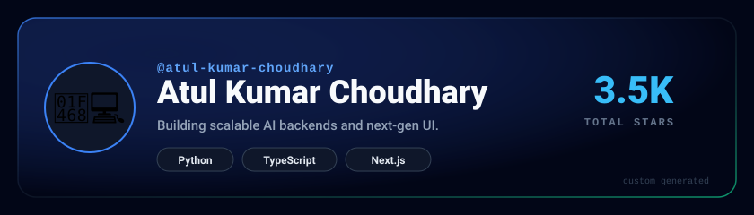
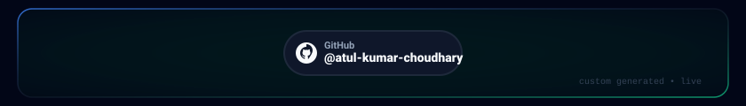

 

 

## 👋 Hello World!

<table>
<tr>
<td width="72%" valign="top">

My mission is to build innovative, AI-driven products and **production-grade platforms** that set the standard for an elite software engineer.

I design and ship **high-throughput distributed systems** and **agentic AI applications**, with a relentless focus on reliability, performance and developer experience.

- 🔭 Currently building an **Agentic Workflow Runner**, a distributed AI platform
- 🧠 Exploring **LLM orchestration**, **RAG** and **evaluation pipelines** at scale
- 🌱 Deep-diving into **Next.js App Router** & **vector databases**
- 💬 Ask me about **full-stack architecture**, **AI infra**, **Kubernetes**
- ⚡ Fun fact: I write my best code between 5 – 7 AM ☕

</td>
<td width="28%" valign="top" align="center">

 
 
 

</td>
</tr>
</table>

 

## 🚀 Contribution Graph

 

 

## 🛠️ Tech Stack & Skills

<table>
<tr>
<td width="50%" valign="top"></td>
<td width="50%" valign="top"></td>
</tr>
<tr>
<td width="50%" valign="top"></td>
<td width="50%" valign="top"></td>
</tr>
</table>

 

## 🚀 Featured Projects

<table>
<tr>
<td width="33%" valign="top"></td>
<td width="33%" valign="top"></td>
<td width="33%" valign="top"></td>
</tr>
</table>

<b>📌 Live pinned repositories (auto-updating)</b>

 

<!-- Replace repo names with your real repositories -->

 

## 📝 Blog Posts

<table>
<tr>
<td width="33%" valign="top"></td>
<td width="33%" valign="top"></td>
<td width="33%" valign="top"></td>
</tr>
</table>

 

## 📇 Contact

<table>
<tr>
<td width="50%" valign="middle">

📞 &nbsp;**+91 12345 67890** 
✉️ &nbsp;**[dev@atulchoudhary.com](mailto:dev@atulchoudhary.com)**

</td>
<td width="50%" valign="middle" align="right">

</td>
</tr>
</table>

