<!-- animated contribution graph: real data, boxes reveal cell by cell
     (regenerated daily by .github/workflows/update-profile-art.yml) -->

<h3><code>atul@github ~ $ ./contributions.sh</code></h3>

 
 

<!-- whoami terminal card (left) + streak/numbers card (right). both svgs are
     840x880 so equal widths give equal heights.
     bio:  python scripts/render_bio_svg.py
     stats: python scripts/render_stats_svg.py (same daily workflow)
     want an animated ASCII portrait instead of the bio card? run:
     python scripts/prep_photo.py <dp.png> && python scripts/make_ascii_svg.py
     then point the left  at ./atul-ascii.svg -->

<h3><code>atul@github ~ $ whoami</code></h3>

<table>
<tr>
<td valign="top"></td>
<td valign="top"></td>
</tr>
</table>

 
 

<h3><code>atul@github ~ $ ./links.sh</code></h3>

<b>Full-Stack AI Engineer · Data Platforms · Distributed Systems</b>

 

